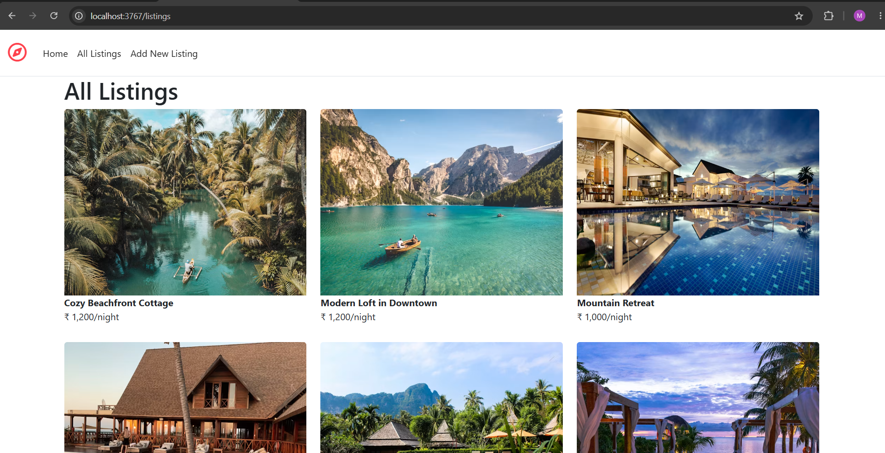
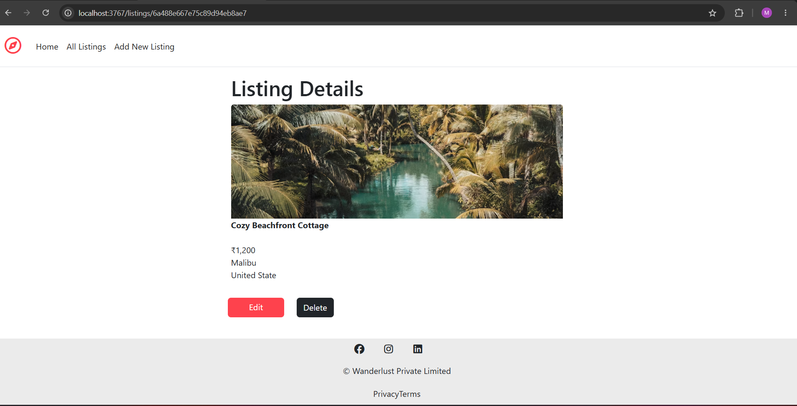
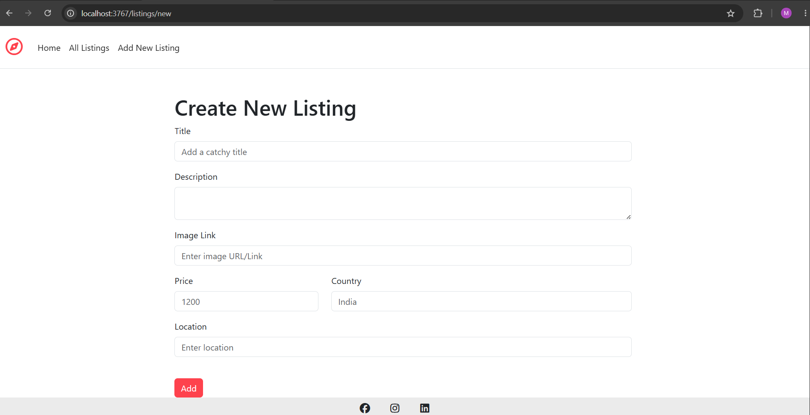
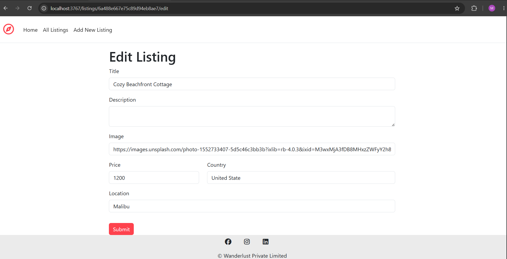

# 🏡 Airbnb Clone

A full-stack Airbnb-inspired web application built with **Node.js**, **Express.js**, **MongoDB**, **Mongoose**, **EJS**, and **Bootstrap**. The application allows users to browse, create, update, and delete property listings while following the MVC architecture and RESTful routing principles.

---

## 📖 About

This project is an Airbnb-inspired web application developed to practice full-stack web development concepts. It demonstrates CRUD operations, server-side rendering, MongoDB database integration, routing, middleware, form validation, and responsive UI development.

---

## ✨ Features

- 🏠 Browse all property listings
- 📄 View listing details
- ➕ Create new listings
- ✏️ Update existing listings
- 🗑️ Delete listings
- 📦 RESTful Routes
- ✅ Server-side Validation using Joi
- ⚠️ Custom Error Handling
- 🎨 Responsive UI with Bootstrap
- 🗂️ MVC Architecture
- 🗃️ MongoDB Database Integration

---

## 🛠️ Tech Stack

### Frontend

- HTML5
- CSS3
- Bootstrap 5
- EJS

### Backend

- Node.js
- Express.js

### Database

- MongoDB
- Mongoose

### Packages Used

- Express
- Mongoose
- EJS
- EJS-Mate
- Joi
- Method-Override

---

## 📁 Project Structure

```
Airbnb-1
│
├── init/
├── models/
├── public/
│   ├── css/
│   ├── js/
│   └── images/
│
├── utils/
├── views/
│   ├── layouts/
│   ├── listings/
│   └── includes/
│
├── screenshots/
│
├── app.js
├── schema.js
├── package.json
├── package-lock.json
└── README.md
```

---

## 🚀 Installation

### Clone Repository

```bash
git clone https://github.com/Ankit3767/Airbnb-1.git
```

### Move into Project Folder

```bash
cd Airbnb-1
```

### Install Dependencies

```bash
npm install
```

### Start MongoDB

Ensure MongoDB is running locally.

Default connection:

```text
mongodb://127.0.0.1:27017/wanderlust
```

### Initialize Sample Data (Optional)

```bash
node init/index.js
```

### Run the Project

```bash
node app.js
```

or

```bash
nodemon app.js
```

Visit:

```
http://localhost:3767/listings
```

---

# 📸 Project Screenshots

## 🏠 Home Page

Displays all available property listings.



---

## 📄 Listing Details

View complete information about a selected property.



---

## ➕ Create New Listing

Create and publish a new property listing.



---

## ✏️ Edit Listing

Update details of an existing listing.



---

## 🚀 Future Enhancements

- User Authentication
- Login & Signup
- Authorization
- Cloudinary Image Upload
- Reviews & Ratings
- Interactive Maps
- Search Functionality
- Category Filters
- Booking System
- Wishlist
- Payment Gateway Integration
- Fully Responsive Mobile UI

---

## 📚 Learning Outcomes

This project helped me understand:

- Express.js Routing
- CRUD Operations
- REST APIs
- MVC Architecture
- MongoDB & Mongoose
- Server-side Rendering using EJS
- Middleware
- Joi Validation
- Error Handling
- Bootstrap
- Git & GitHub Workflow

---

## 🤝 Contributing

Contributions are welcome.

1. Fork the repository

2. Create a branch

```bash
git checkout -b feature-name
```

3. Commit changes

```bash
git commit -m "Add feature"
```

4. Push

```bash
git push origin feature-name
```

5. Open a Pull Request

---

## 👨‍💻 Author

**Ankit Kumar**

GitHub: https://github.com/Ankit3767

---

## ⭐ Support

If you found this project useful, consider giving it a **⭐ Star** on GitHub.

---

## 📄 License

This project is created for educational purposes only.

Inspired by Airbnb's user interface and functionality.
